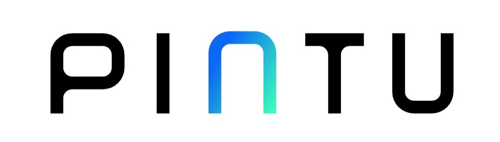

<!-- Improved compatibility of back to top link: See: https://github.com/othneildrew/Best-README-Template/pull/73 -->

<a name="readme-top"></a>

<!--
*** Thanks for checking out the Best-README-Template. If you have a suggestion
*** that would make this better, please fork the repo and create a pull request
*** or simply open an issue with the tag "enhancement".
*** Don't forget to give the project a star!
*** Thanks again! Now go create something AMAZING! :D
-->

<!-- PROJECT SHIELDS -->
<!--
*** I'm using markdown "reference style" links for readability.
*** Reference links are enclosed in brackets [ ] instead of parentheses ( ).
*** See the bottom of this document for the declaration of the reference variables
*** for contributors-url, forks-url, etc. This is an optional, concise syntax you may use.
*** https://www.markdownguide.org/basic-syntax/#reference-style-links
-->

[![Contributors][contributors-shield]][contributors-url]
[![Forks][forks-shield]][forks-url]
[![Stargazers][stars-shield]][stars-url]
[![Issues][issues-shield]][issues-url]
[![MIT License][license-shield]][license-url]
[![LinkedIn][linkedin-shield]][linkedin-url]

<!-- PROJECT LOGO -->
<br />
<div align="center">
  <a href="https://github.com/zaidanammar/pintu-mobile">
    
  </a>

  <h3 align="center">Pintu App</h3>

  <p align="center">
    An awesome token market list
    <br />
    <a href="https://github.com/zaidanammar/pintu-mobile"><strong>Explore the docs »</strong></a>
    <br />
    <br />
    <a href="https://pintu-aja.vercel.app">View Demo</a>
    ·
    <a href="https://github.com/zaidanammar/pintu-mobile/issues">Report Bug</a>
    ·
    <a href="https://github.com/zaidanammar/pintu-mobile/issues">Request Feature</a>
  </p>
</div>

<!-- TABLE OF CONTENTS -->
<details>
  <summary>Table of Contents</summary>
  <ol>
    <li>
      <a href="#about-the-project">About The Project</a>
      <ul>
        <li><a href="#built-with">Built With</a></li>
      </ul>
    </li>
    <li>
      <a href="#getting-started">Getting Started</a>
      <ul>
        <li><a href="#prerequisites">Prerequisites</a></li>
        <li><a href="#installation">Installation</a></li>
      </ul>
    </li>
    <li><a href="#usage">Usage</a></li>
    <li><a href="#roadmap">Roadmap</a></li>
    <li><a href="#contributing">Contributing</a></li>
    <li><a href="#license">License</a></li>
    <li><a href="#contact">Contact</a></li>
    <li><a href="#acknowledgments">Acknowledgments</a></li>
  </ol>
</details>

<!-- ABOUT THE PROJECT -->

## About The Project

- App Preview

There are many great README templates available on GitHub; however, I didn't find one that really suited my needs so I created this enhanced one. I want to create a README template so amazing that it'll be the last one you ever need -- I think this is it.

Here's why:

- Your time should be focused on creating something amazing. A project that solves a problem and helps others
- You shouldn't be doing the same tasks over and over like creating a README from scratch
- You should implement DRY principles to the rest of your life :smile:

Of course, no one template will serve all projects since your needs may be different. So I'll be adding more in the near future. You may also suggest changes by forking this repo and creating a pull request or opening an issue. Thanks to all the people have contributed to expanding this template!

Use the `BLANK_README.md` to get started.

<p align="right">(<a href="#readme-top">back to top</a>)</p>

### Built With

This section should list any major frameworks/libraries used to bootstrap your project. Leave any add-ons/plugins for the acknowledgements section. Here are a few examples.

- [![Reactnative][reactnative]][reactnative-url]
- [![Typescript][typescript]][typescript-url]
- [![TailwindCSS][tailwindcss]][tailwindcss-url]
- [![Eslint][eslint]][eslint-url]
- [![Prettier][prettier]][prettier-url]
- [Husky][husky-url]
- [React-Query][react-query-url]
- [Expo][expo-url]
- [Native Base][nativebase-url]
- [Native Wind][nativewind-url]

<p align="right">(<a href="#readme-top">back to top</a>)</p>

<!-- GETTING STARTED -->

## Getting Started

This is an example of how you may give instructions on setting up your project locally.
To get a local copy up and running follow these simple example steps.

### Installation

_Below is an example of how you can instruct your audience on installing and setting up your app. This template doesn't rely on any external dependencies or services._

1. Clone the repo
   ```sh
   git clone https://github.com/zaidanammar/pintu-mobile.git
   ```
2. Install NPM packages
   ```sh
   npm install or yarn install
   ```
3. Enter your configuration project in `.env`, in a module you will work on
   ```js
   NEXT_PUBLIC_API = 'ENTER YOUR SECRET KEY'
   ```

<p align="right">(<a href="#readme-top">back to top</a>)</p>

<!-- USAGE EXAMPLES -->

## Usage

How to run a project, please follow the instructions below.

1. Run the Project

```bash
npm run start or yarn start
```

<p align="right">(<a href="#readme-top">back to top</a>)</p>

<!-- ROADMAP -->

## Roadmap

- [x] Slicing components and replicate pintu app

See the [open issues](https://github.com/zaidanammar/pintu-mobile/issues) for a full list of proposed features (and known issues).

<p align="right">(<a href="#readme-top">back to top</a>)</p>

<!-- CONTRIBUTING -->

## Contributing

Contributions are what make the open source community such an amazing place to learn, inspire, and create. Any contributions you make are **greatly appreciated**.

If you have a suggestion that would make this better, please fork the repo and create a pull request. You can also simply open an issue with the tag "enhancement".
Don't forget to give the project a star! Thanks again!

1. Fork the Project
2. Create your Feature Branch (`git checkout -b feature/AmazingFeature`)
3. Commit your Changes (`git commit -m 'Add some AmazingFeature'`)
4. Push to the Branch (`git push origin feature/AmazingFeature`)
5. Open a Pull Request

<p align="right">(<a href="#readme-top">back to top</a>)</p>

<!-- LICENSE -->

## License

Distributed under the MIT License. See `LICENSE.txt` for more information.

<p align="right">(<a href="#readme-top">back to top</a>)</p>

<!-- CONTACT -->

## Contact

Muammar Zaidan - [@zaidanammar](https://twitter.com/zaidanammar) - zaidanammar23@gmail.com

Project Link: [https://github.com/zaidanammar/pintu-mobile](https://github.com/zaidanammar/pintu-mobile)

<p align="right">(<a href="#readme-top">back to top</a>)</p>

<!-- ACKNOWLEDGMENTS -->

## Acknowledgments

Use this space to list resources you find helpful and would like to give credit to. I've included a few of my favorites to kick things off!

- [Choose an Open Source License](https://choosealicense.com)
- [GitHub Emoji Cheat Sheet](https://www.webpagefx.com/tools/emoji-cheat-sheet)
- [Img Shields](https://shields.io)
- [React Icons](https://react-icons.github.io/react-icons/search)

<p align="right">(<a href="#readme-top">back to top</a>)</p>

<!-- MARKDOWN LINKS & IMAGES -->
<!-- https://www.markdownguide.org/basic-syntax/#reference-style-links -->

[contributors-shield]: https://img.shields.io/github/contributors/zaidanammar/pintu?style=for-the-badge
[contributors-url]: https://github.com/zaidanammar/pintu-mobile/graphs/contributors
[forks-shield]: https://img.shields.io/github/forks/zaidanammar/pintu.svg?style=for-the-badge
[forks-url]: https://github.com/zaidanammar/pintu-mobile/network/members
[stars-shield]: https://img.shields.io/github/stars/zaidanammar/pintu.svg?style=for-the-badge
[stars-url]: https://github.com/zaidanammar/pintu-mobile/stargazers
[issues-shield]: https://img.shields.io/github/issues/zaidanammar/pintu.svg?style=for-the-badge
[issues-url]: https://github.com/zaidanammar/pintu-mobile/issues
[license-shield]: https://img.shields.io/github/license/zaidanammar/pintu.svg?style=for-the-badge
[license-url]: https://github.com/zaidanammar/pintu-mobile/blob/master/LICENSE.txt
[linkedin-shield]: https://img.shields.io/badge/-LinkedIn-black.svg?style=for-the-badge&logo=linkedin&colorB=555
[linkedin-url]: https://www.linkedin.com/in/muammar-zaidan/
[product-screenshot]: public/screenshot.png
[lighthouse-screenshot]: public/lighthouse-score.png
[reactnative]: https://img.shields.io/badge/React_Native-20232A?style=for-the-badge&logo=react&logoColor=61DAFB
[reactnative-url]: https://reactnative.dev/
[typescript]: https://img.shields.io/badge/TypeScript-007ACC?style=for-the-badge&logo=typescript&logoColor=white
[typescript-url]: https://www.typescriptlang.org/
[tailwindcss]: https://img.shields.io/badge/Tailwind_CSS-38B2AC?style=for-the-badge&logo=tailwind-css&logoColor=white
[tailwindcss-url]: https://tailwindcss.com/
[eslint]: https://img.shields.io/badge/eslint-3A33D1?style=for-the-badge&logo=eslint&logoColor=white
[eslint-url]: https://eslint.org/
[prettier]: https://img.shields.io/badge/prettier-1A2C34?style=for-the-badge&logo=prettier&logoColor=F7BA3E
[prettier-url]: https://prettier.io/
[vercel]: https://img.shields.io/badge/Vercel-000000?style=for-the-badge&logo=vercel&logoColor=white
[vercel-url]: https://vercel.com/
[react-query-url]: https://tanstack.com/query/v4
[husky-url]: https://typicode.github.io/husky/#/
[expo-url]: https://expo.dev/
[nativewind-url]: https://www.nativewind.dev/
[nativebase-url]: https://nativebase.io/
